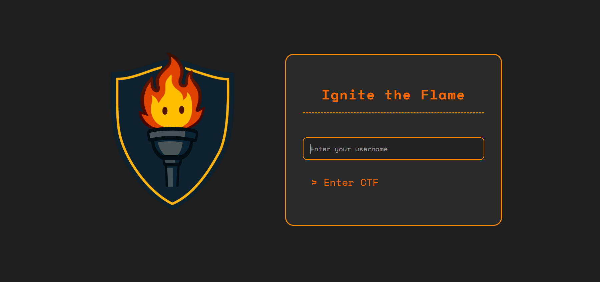
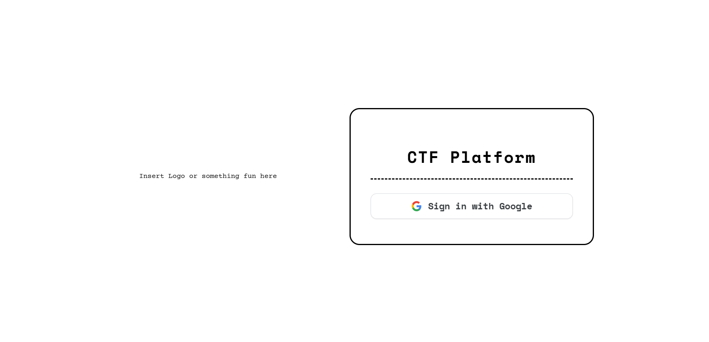
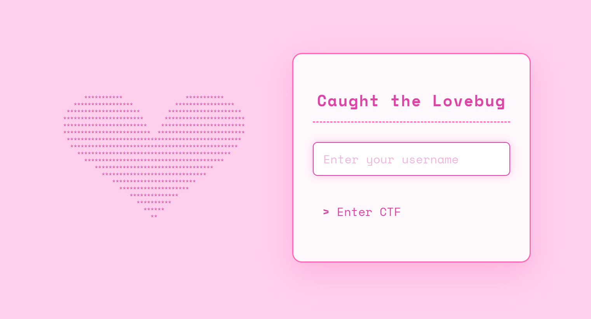

# Our CTF Platform

This is the platform that was used to host the **Capture the Flame** Mini-CTFs throughout the Spring 2026 school semester. Created to easily host challenges in a dynamic environment, this platform was used to host the events: 
- Caught the Lovebug  
- Ignite the Flame
- Into the Flame  
- Byte the Flame  

Each hosted event last 2 hours, allowing this platform to become our new go-to for easy maintenance. 

Our platform was used with a **manual** user registration system over a **vercel frontend** + **railway backend** for the first two events, with two being implemented with migration to **creator managed servers** paired with **Google OAuth Login**.

**Originally** intended for use in the mini competitions, this website was used as the foundations for the **Capture the Flame 2027** CTF platform.

    

## Features
- **Dynamic** scoring system  
- **Real-time** UI updates and notifications 
- **Google OAuth**  
- **Leaderboard tracking** for competitor progression  
- **Admin Dashboard** for challenge maintenance  
- Template based site to allow for **customizable UI**  

## Tech Stack
- React
- Django
- PostgreSQL
- Vercel
- Railway
- Server Management

## How was it used?

The platform was deployed to host the various mini competitions, allowing for the **Capture the Flame team** to 
- **Reliably** distribute callenge files  
- **Validate** user input  
- **Monitor user issues** in real time  
- **Customize** the UI while retaining the core functionality of site per event

 

Each event contained a **varying color theme** that was used by **forking the main branch** (the template branch) 

 
After each event, the deployed sites were left up, all students to participate despite not being at the event. Also, allowing the team to gauge student participation. 

 

  
<b>Different UIs</b>

    

        
    

    

        
    

    

        
    

  </a>

## Creator

### Anirudh Yallapragada

